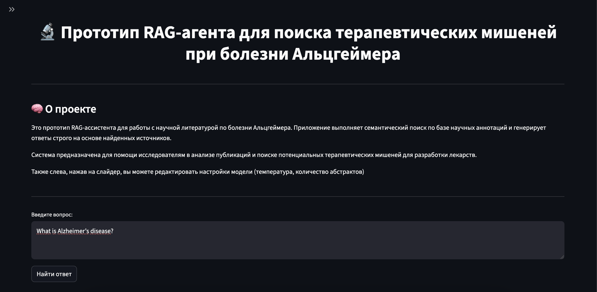
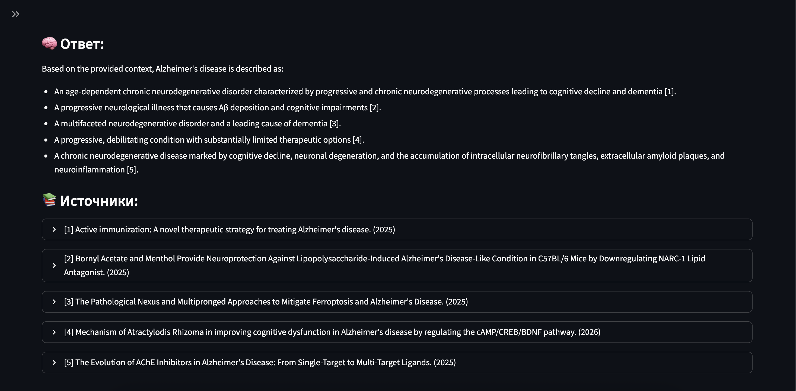

# RAG-агент для болезни Альцгеймера (pet-project)

Прототип RAG-ассистента для поиска информации в научной литературе по болезни Альцгеймера.

Онлайн-версия: https://rag-alzheimer.streamlit.app/

Интерфейс:

Запуск на macOS:

1. Установить зависимости:
pip install -r requirements.txt

2. Создать API-ключ: https://openrouter.ai/keys

3. Задать ключ:
export OPENROUTER_API_KEY="sk-or-..."

4. Запустить:
streamlit run app.py
